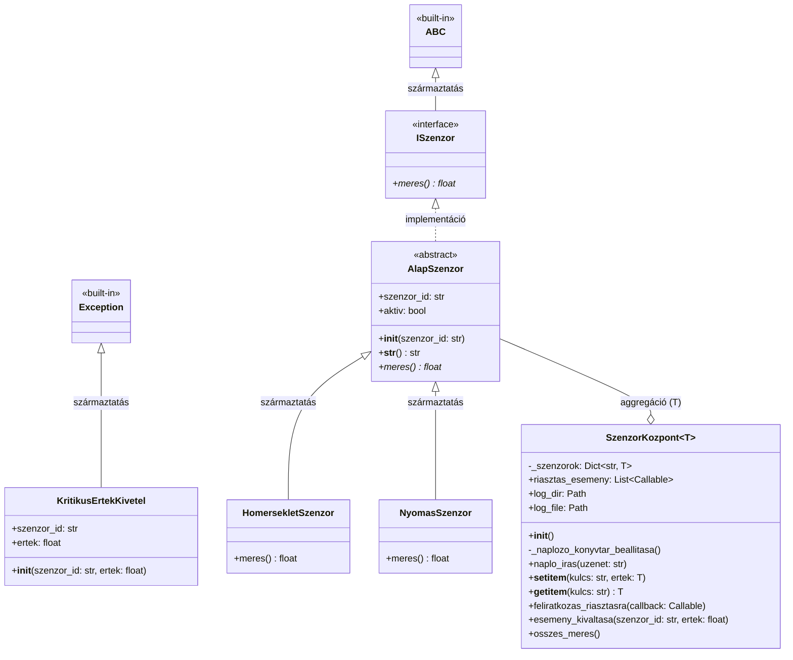

# Dokumentáció: Okos Gyár – Szenzorhálózat Kezelő Rendszer

## 1. Fejlesztői és futtatói környezet
* **Programozási nyelv:** Python
* **Minimális verziókövetelmény:** Python 3.7+ (a `typing` modul fejlettebb típusannotációi, valamint a `pathlib` modul miatt).
* **Felhasznált beépített könyvtárak:**
    * `os`, `pathlib`: Fájlrendszer műveletek, naplózási könyvtár kezelése.
    * `random`: Szenzoradatok (hőmérséklet és nyomás) szimulálása.
    * `abc`: Tisztán absztrakt osztályok (interfészek) létrehozása.
    * `typing`: Statikus típusellenőrzés támogatása (Generics, TypeVar, Callable, Dict, List).
    * `datetime`: Időbélyegek generálása a naplózáshoz.
* **Külső függőségek:** A program kizárólag a Python Standard Library-t használja, így `pip install` parancs futtatására nincs szükség.

---

## 2. Adatszerkezet
A program a következő főbb adatszerkezeteket alkalmazza az adatok tárolására és kezelésére:
* **Szótár (Dictionary):** A `SzenzorKozpont` osztály egy rejtett `_szenzorok` nevű `Dict[str, T]` struktúrában tárolja a szenzorokat. A kulcs (string) a szenzor egyedi azonosítója, az érték (`T`) pedig az `AlapSzenzor` egy leszármazott példánya.
* **Lista (List):** Az eseményvezérelt működéshez a feliratkozókat (függvényeket, lambdákat) egy `List[Callable[[str, float], None]]` típusú `riasztas_esemeny` nevű listában tárolja a rendszer.

---

## 3. Megvalósítási részletek feladatonként

### 3.1. Interfészek és Absztrakt osztályok
A Python nyelv nem tartalmaz dedikált `interface` kulcsszót, így ezt a szerepet az `abc.ABC` modulból származtatott tisztán absztrakt osztály tölti be.
* **`ISzenzor`**: Tartalmaz egy `meres()` metódust, amely `@abstractmethod` dekorátorral van ellátva.
* **`AlapSzenzor`**: Implementálja az `ISzenzor`-t, de továbbra is absztrakt marad. Definiálja az alapvető attribútumokat (`szenzor_id`, `aktiv`), és biztosít egy felülírt `__str__` metódust az objektumok formázott kiíratásához.

### 3.2. Származtatás és Virtuális metódusok
Az `AlapSzenzor` osztályból két konkrét osztály származik:
* **`HomersekletSzenzor`**: A `meres()` metódust úgy írja felül, hogy az -10.0 és 50.0 közötti véletlenszerű lebegőpontos számot adjon vissza.
* **`NyomasSzenzor`**: A `meres()` metódus 0.5 és 3.5 közötti értéket generál. A virtuális metódusok biztosítják a polimorf viselkedést a végrehajtás során.

### 3.3. Kivételkezelés
A **`KritikusErtekKivetel`** az alapértelmezett `Exception` osztályból származik. A `NyomasSzenzor` veti el (`raise`), ha a mért érték meghaladja a 3.0-t. A hibát a `SzenzorKozpont.osszes_meres()` metódusában található `try-except` blokk kapja el, amely megakadályozza a program leállását, és gondoskodik a hiba fájlba írásáról.

### 3.4. Gyűjtemények és Generikus típusok
A **`SzenzorKozpont`** egy generikus osztály (`Generic[T]`), ahol a `T` típusparamétert a `TypeVar('T', bound=AlapSzenzor)` korlátozza. Ez biztosítja, hogy a központba csak megfelelő típusú (szenzor) objektumokat lehessen regisztrálni, és a statikus típusellenőrzők (pl. mypy) számára is egyértelmű legyen az adatszerkezet tartalma.

### 3.5. Indexelők
A Python ún. *magic method*-jainak (`__setitem__` és `__getitem__`) definiálásával a `SzenzorKozpont` példánya tömbszerűen vagy szótárszerűen indexelhetővé válik az osztályon kívülről. Így a regisztráció a `kozpont["ID"] = objektum` szintaxissal, a lekérdezés pedig a `kozpont["ID"]` szintaxissal hajtható végre.

### 3.6. Események, metódusreferenciák és lambda kifejezések
A `SzenzorKozpont` az Observer (megfigyelő) tervezési mintát alkalmazza egyszerűsített formában.
* A `feliratkozas_riasztasra()` metódus lehetővé teszi a hívható (callable) objektumok rögzítését a belső listában.
* Ha a `meres()` eredménye meghaladja a beégetett határt (40.0), lefut az `esemeny_kivaltasa()` metódus, amely minden feliratkozót értesít.
* A főprogram (main) kétféleképpen is feliratkozik: egyszer egy lokálisan definiált függvény nevét (metódusreferencia) átadva (`konzolos_riasztas`), egyszer pedig egy névtelen inline `lambda` kifejezés formájában.

### 3.7. Fájl- és könyvtárkezelés
A `pathlib` modul `Path` osztálya gondoskodik a robusztus, operációs rendszertől független útvonal-kezelésről. A program indulásakor ellenőrzi a `naplok` mappa létezését, ha nincs, a `mkdir(exist_ok=True)` létrehozza. A `naplo_iras()` metódus `append` (`"a"`) módban nyitja meg a fájlt, így a korábbi logok nem íródnak felül, hanem kiegészülnek egy új sorral, mely a beépített `datetime` modullal generált pontos időbélyeget is tartalmazza.

---

## 4. Kódtérkép

A `main.py` logikai felépítése sorrendben az alábbi:
1.  **Importálások**: Rendszermodulok, absztrakció, tipizálás, dátum és útvonal.
2.  **Interfész / Absztrakció**: `ISzenzor` (sor: 10), majd az ebből származó `AlapSzenzor` (sor: 16).
3.  **Kivétel definiálása**: Egyedi hibaosztály `KritikusErtekKivetel` (sor: 25).
4.  **Konkrét implementációk**: `HomersekletSzenzor` (sor: 32) és `NyomasSzenzor` (sor: 38) mérési logikával.
5.  **Generikus Konténer**: `SzenzorKozpont` osztály (sor: 50). Magában foglalja a loggolás inicializálását, indexelőket, feliratkozás-kezelést, eseménykiváltást és az adatok tömeges lekérését kivételkezeléssel.
6.  **Belépési pont**: `main()` függvény (sor: 96) a példányosításokhoz, feliratkozásokhoz és a mérési ciklusok (szimuláció) futtatásához.
7.  **Szkript végrehajtás**: Az `if __name__ == "__main__":` blokk biztosítja, hogy a kód csak közvetlen futtatáskor induljon el.

---

## 5. Osztálydiagram

